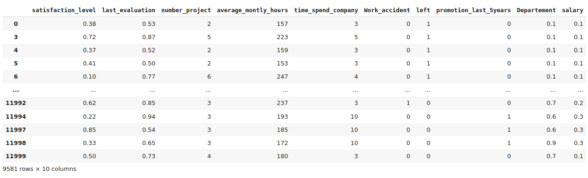

# Data Analysis and Clustering Techniques

**Author:** Khouloud Kessentini  

## Project Summary
This project involves studying a dataset using various data preprocessing, normalization, visualization, and clustering techniques to uncover patterns and insights.

## Project Structure

1. **Data Preprocessing**  
   Initial data cleaning and transformation steps to prepare the dataset.

2. **Data Normalization**  
   Standardizing data to ensure consistency across variables.

3. **Visualization**  
   Creating visualizations to explore data patterns and trends.

4. **Principal Component Analysis (PCA)**  
   Reducing dimensionality to focus on the primary components that capture most of the data’s variance.

5. **Interpretations**  
   Analyzing PCA results for insights into underlying data structures.

6. **Hierarchical Clustering**  
   Using hierarchical clustering to group similar data points and create a dendrogram.

7. **K-Means Algorithm**  
   Applying K-Means clustering to organize data into specific groups based on similarity.

   
```python
import pandas as pd
```

**Read data file**
```python
DATA = pd.read_csv('/content/drive/MyDrive/HR_SBA_Software.csv')
```


# Data preprocessing

**Satisfaction level must be between 0 and 1** <br/>
We will proceed with a check to ensure all our data is within the [0, 1] range
```python
print("Valeur minimale",min(DATA.satisfaction_level))
print("Valeur maximale",max(DATA.satisfaction_level))
```

**The values for the variable "last_evaluation" must be between 0 and 1**<br/>
We will proceed with a check to ensure all our data is within the [0, 1] range

```python
print("Valeur minimale",min(DATA.last_evaluation))
print("Valeur maximale",max(DATA.last_evaluation))
```

**We must check that there are no negative values for the variable "number_project"**
```python
if (min(DATA.number_project>=0)):
  print ("Pas de valeurs négative! La première condition est vérifiée")
else:
  print("Il y'a des valeurs négatives! On doit corriger quelques observations")
```

**We must check that there are no excessive values for the number of projects**
```python
print("Nombre maximal de projets: ", max(DATA.number_project))
```

**On doit vérifier qu'il n'y'a pas de valeurs négatives pour le nombre de projets**
```python
print("Nombre maximal de projets: ", min(DATA.number_project))
```

**The minimum number must not be negative** <br/>
**It should also be a reasonable value (for example: 2 hours/month is not reasonable)**
```python
print(min(DATA.average_montly_hours))
```
**The reasonable maximum number per month is 275 (which is 10 hours maximum per day and 6 days/week)**

```python
print(max(DATA.average_montly_hours))
```
**We will eliminate observations greater than 250 hours**<br/>
**An observation with a number of hours greater than 250 is considered to be an excessively high value**

```python
indexNames = DATA[ DATA['average_montly_hours']>250].index
DATA.drop(indexNames, inplace=True)
```


**The minimum and maximum values are 2 and 10 years (reasonable values)**
```python
print ("temps minimal à l'entreprise", min(DATA.time_spend_company))
print ("temps maximal à l'entreprise", max(DATA.time_spend_company ))
```
**This value is binary, either 0 or 1<br/>
We will check that there are no other values (e.g., 2, 0.5, -1, etc.)<br/>
We calculate the occurrence of 0 and the occurrence of 1<br/>
and compare their sums against the total number of observations**
```python
occurence_0 = DATA.Work_accident[DATA['Work_accident']==0].count()
occurence_1 = DATA.Work_accident[DATA['Work_accident']==1].count()
len(DATA) == occurence_0 + occurence_1
```

**This value is binary, either 0 or 1<br/>
We will check that there are no values other than 0 and 1<br/>
We calculate the occurrence of 0 and the occurrence of 1 and compare their sums against the total number of observations**
```python
occurence_0 = DATA.left[DATA['left']==0].count()
occurence_1 = DATA.left[DATA['left']==1].count()
len(DATA) == occurence_0 + occurence_1
```

**The number of promotions must not be negative<br/>
It should also be a reasonable value (for example: 10 promotions in 5 years is not reasonable)**
```python
print ("Nombre minimal de promotions", min(DATA.promotion_last_5years))
print ("Nombre maximal de promotions", max(DATA.promotion_last_5years))
```
**It seems there is a mistake in the column name<br/>
It should be "Departement" instead of "sales"<br/>
We will change the column name from "sales" to "Departement"**
```python
DATA.columns=['satisfaction_level','last_evaluation','number_project','average_montly_hours','time_spend_company',
              'Work_accident','left','promotion_last_5years','Departement', 'salary']
```
**We will visualize the existing departments and check for any input errors**
```python
DATA['Departement'].unique()
```

**Elimination of duplicates**
```python
DATA.drop_duplicates(keep='first', inplace=True)
```
**We need numerical data to apply PCA**<br\> 
We will replace qualitative data with quantitative data<br\> 
sales = 1  -- accounting = 2 -- hr = 3 -- technical = 4 -- support = 5 management = 6 -- IT = 7 -- product_mng = 8 -- marketing = 9 -- RandD = 10<br\> 

**There are two methods to perform this task:**
**1. Replacing a single value, for example:**
```python
DATA['Departement'] = DATA['Departement'].replace(['sales'], 0.1)
DATA['Departement'] = DATA['Departement'].replace(['accounting'], 0.2)
DATA['Departement'] = DATA['Departement'].replace(['hr'], 0.3)
DATA['Departement'] = DATA['Departement'].replace(['technical'], 0.4)
```

**2. Replacing multiple values in parallel**
```
DATA['Departement'] = DATA['Departement'].replace(['support','management','IT'], [0.5,0.6,0.7])
DATA['Departement'] = DATA['Departement'].replace(['product_mng','marketing','RandD'], [0.8,0.9,1])
```

**Now let's verify that all departments have been modified**
```
DATA['Departement'].unique()
```
**Transform qualitative data into quantitative data**
```python
DATA['salary'] = DATA['salary'].replace(['low', 'medium', 'high'], [0.1, 0.2, 0.3])
```
**Verify the transformations**
```python
print(DATA['salary'].unique())
```


on remarque ici que la corrélation entre nos données n'est pas très forte
pas de corrélation forte ni positive (tend vers 1) ni négative (tends vers -1)
```python
import matplotlib.pyplot as plt
import seaborn
plt.subplots_adjust(hspace=10, wspace=0.1,bottom=0.1)
matrice=DATA.corr()
seaborn.heatmap(matrice,annot=True)
plt.show()
```


**Import necessary libraries**
```python
from sklearn.decomposition import PCA
```
**Create an instance of the PCA class, here named "ACP"**
```python
ACP = PCA()
```
**Apply PCA transformation on dataset Z**
```python
Z_transformed = ACP.fit_transform(Z)
```
Z_transformed now contains the transformed data in terms of principal components

** Now we calculate the variance of each variable, i.e., the contribution of each variable to the total amount of information.**
```python
ACP.explained_variance_
```
